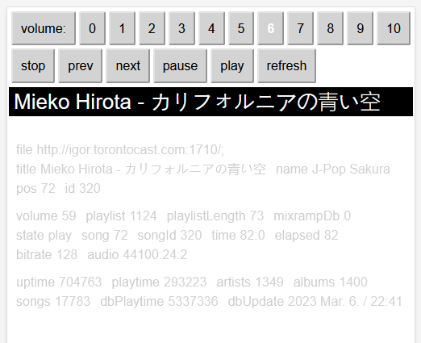

# moped

Moped is a minimal web interface for MPD that shows the current song playing,
along with some basic controls. It is **NOT** a full featured client.

## ui

## notes

The MPD protocol is a "streamingish" protocol and translating it to REST
is far from ideal: ncmpcpp running on a 80x25 terminal will be much faster
through ssh, especially with long running commands, since it can dump
the server output as it comes in, instead of waiting for the final OK
marker.

A REST api will keep the http channel open, until the response is finished
and is ready to send down the wire, to the client.
