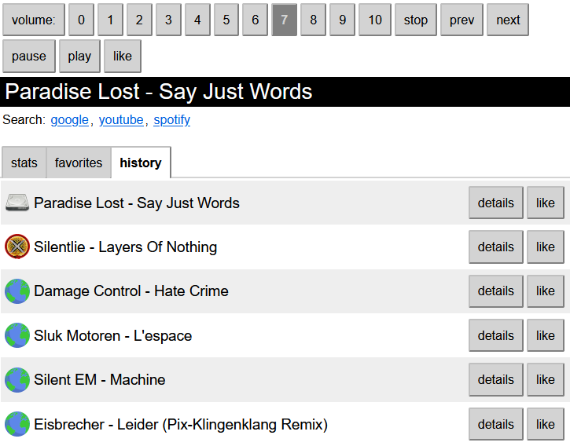

# moped

Moped is a minimal web interface for MPD that shows the current song playing,
along with some basic controls. It is **NOT** a full featured client.

It's just a quick hack for myself so that I can change the volume
on the server and see what's playing from my phone (otherwise ssh
with ncpmpcpp is the simplest and best way to access the server).

## ui

- **v1**: vanilla js in /public
- **v2**: react ts in /client, see [README](./client/README.md)

## usage (v2)

1. copy the `.env.example` templates to `.env` files [in the project root](./.env.example)
   AND [in client](./client/.env.example) and do edit them
   - in BOTH the client and server `.env` set the network host and port to the same (eg. `192.168.0.123` and `8080`)
   - if you are using a firewall, then please open the port you want to listen on (for example `8080`)
2. use `npm start` to compile the server and the client and start them up
3. or alternatively check the `package.json` in root and in client

## notes

The MPD protocol is a "streamingish" protocol and translating it to REST
is far from ideal: ncmpcpp running on a 80x25 terminal will be much faster
through ssh, especially with long running commands, since it can dump
the server output as it comes in, instead of waiting for the final OK
marker.

A REST api will keep the http channel open, until the response is finished
and is ready to send down the wire, to the client.
